# 第一个游戏

这节我们从头做一个比较有意思的小游戏——一步两步。

下面是最终效果(跳一步得一分，跳两步得三分，电脑端左右键12步）：

[一步两步](https://ccc.xinshouit.com/demo/one-two-step/ ':include :type=iframe width=320px height=180px')

## 写在前面

这是本教程第一个游戏，所以我会讲的详细一点，但是也不能避免遗漏，所以有什么问题你可以先尝试查阅文档自己解决或者在下方留言，后面我会跟进完善。

另外这个游戏并非原创，参照的是腾讯的微信小游戏《一步两步H5》，请不要直接搬过去，微信里重复的游戏太多了。

## 创建工程

选择空白项目创建工程


你可以从[这里](https://github.com/potato47/one-two-step/releases/download/v2.0/one-two-step-res.zip)下载游戏素材,然后将素材导入工程（直接拖进编辑器，或者放在工程目录）

也可以从[https://github.com/potato47/one-two-step](https://github.com/potato47/one-two-step)下载完整代码进行参照。

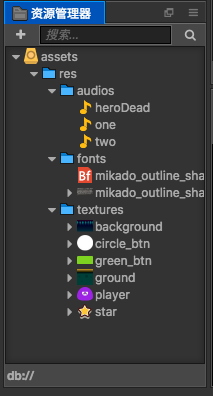

 > 准备工作做完后，我会把这个游戏制作过程分为若干个小过程，让你体会一下实际的游戏制作体验。

## 从一个场景跳转到另一个场景

在res文件夹下新建一个scenes文件夹，然后在scenes里新建两个场景menu和game（右键->新建->Scene)。然后双击menu进入menu场景。

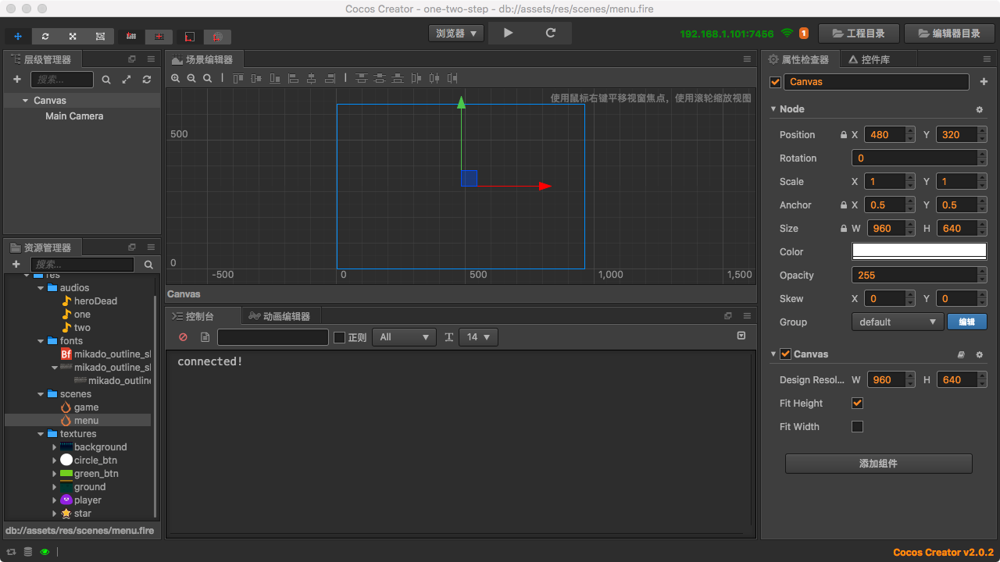

在层级管理器中选中Canvas节点，在右侧属性检查器中将其设计分辨率调整为1280x720，然后将background图片拖入Canvas节点下，并为其添加Widget组件（添加组件->UI组件->Widget),使其充满画布。

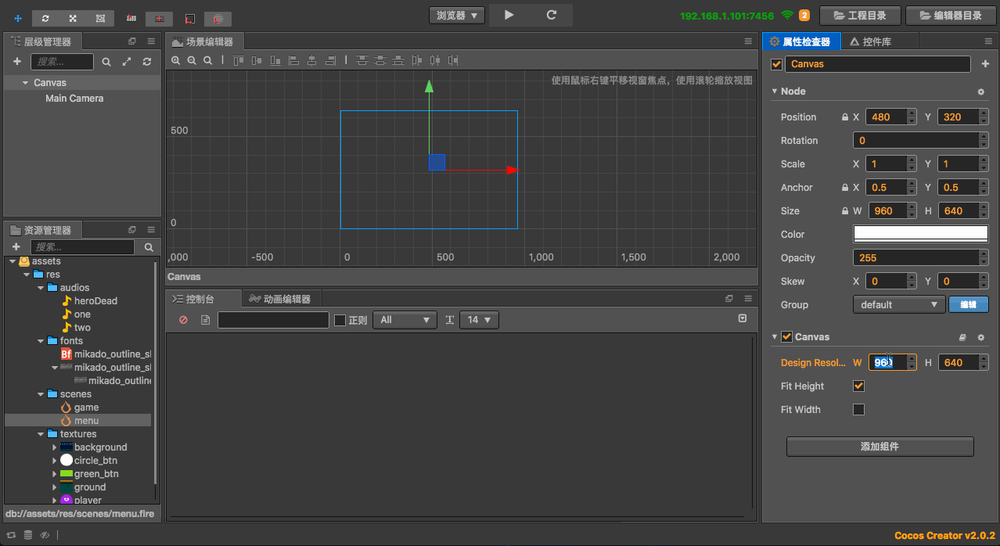

在Canvas下新建一个Label节点（右键->创建节点->创建渲染节点->Label），然后调整文字大小，并添加标题文字


我们知道节点和组件通常是一起出现的，带有常见组件的节点在编辑器里可以直接创建，比如刚才的带有Label组件的节点和带有Sprite组件的节点，但是我们也可以新建一个空节点然后为其添加对应的组件来组装一个带有特殊功能的节点。

新建节点->UI节点下有一个Button，如果你直接创建Button，你会发现它是一个带有Button组件的节点，并且有一个Label的子节点。现在我们用另一种方法创建Button：在Canvas右键新建一个空节点，然后为其添加Button组件，这时你会发现按钮并没有背景，所以我们再添加一个Sprite组件，拖入资源中的按钮背景图片，最后添加一个Label子节点给按钮添加上文字。


下面我们给这个按钮添加点击事件。

在资源管理器中新建src文件夹用来存放脚本，然后新建一个TypeScript脚本，名字为Menu（注意脚本组件名称区分大小写，这里建议首字母大写）。


双击用VS Code打开脚本，更改如下：

``` javascript
const { ccclass } = cc._decorator;

@ccclass // 让编辑器能够识别这是一个组件
export class Menu extends cc.Component {

    private onBtnStart() {
        cc.director.loadScene('game'); //加载game场景
    }

}
```

> 一个类只有加上@ccclass才能被编辑器识别为脚本组件，如果你去掉@ccclass，你就不能把这个组件拖到节点上。另外可以看到代码中出现了几次cc这个东西，cc其实是Cocos的简称，在游戏中是引擎的主要命名空间，引擎代码中所有的类、函数、属性和常量都在这个命名空间中定义。

很明显，我们想在点击开始按钮的时候调用onBtnStart函数，然后跳转到game场景。为了测试效果我们先打开game场景，然后放一个测试文字（将Canvas的设计分辨率也改为1280x720）。


保存game场景后再回到Menu场景。

Button组件点击后会发出一个事件，这个事件可以跟某个节点上的某个脚本内的某个函数绑定在一起。听着有点绕，动手做一遍就会明白这个机制。

首先将Menu脚本添加为Canvas节点的组件，然后在开始按钮的Button组件里添加一个Click Event，将其指向Canvas节点下的Menu脚本里的onBtnStart函数。


我们再调整一下Button的点击效果,将Button组件的Transition改为scale（伸缩效果），另外还有颜色变化和图片变化，可以自己尝试。

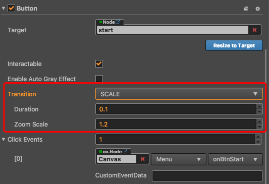

最后点击上方的预览按钮，不出意外的话就可以在浏览器中看见预期效果。


## 组织代码结构

现在我们来编写游戏逻辑。

首先我来讲一下我看到的一种现象：

很多新手非常喜欢问，“看代码我都能看懂啊，但是要我自己写我就没思路啊”

这时一位经验颇多的长者就会甩给他一句，“多写写就有思路了“

不知道你们发现没有，这竟然是一个死循环。

对于一个刚开始学习做游戏的人，首先要了解的是如何组织你的代码，这里我教给大家一个最容易入门的代码结构——单向分权结构（这是我想了足足两分钟的自认为很酷炫的一个名字）

脚本分层：

这个结构最重要的就是“权”这个字，我们把一个场景中使用的脚本按照“权力”大小给它们分层，权力最大的在最上层且只有一个，这个脚本里保存着它直接控制的若干个脚本的引用，被引用的脚本权力就小一级，被引用的脚本还会引用比它权力更小的脚本，依此类推。

脚本互操作：

1. 上一层的脚本由于保存着下一层脚本的引用，所以可以直接操作下一层的脚本。
2. 下一层的脚本由上一层的脚本初始化，在初始化的时候会传入上一层的引用（可选），这样在需要的时候会反馈给上一层，由上一层执行更具体的操作。
3. 同层的脚本尽量不要互相操作，统一交给上层处理，同层解耦。
4. 不可避免的同层或跨层脚本操作可以使用全局事件来完成。
5. 具有通用功能的脚本抽离出来，任意层的脚本都可以直接使用。

写了这么多，但你肯定没看懂，现在你可以翻到最上面再分析一下游戏的game场景，如何组织这个场景的脚本结构？

首先，一个场景的根节点会挂载一个脚本，通常以场景名命名，这里就是Game。

然后跳跃的人物也对应着一个脚本Player。

跟Player同层的还应该有Block也就是人物踩着的地面方块。

因为Player和Block之间互相影响并且我想让Game脚本更简洁，所以这里再加一个Stage（舞台）脚本来控制Player和Block。

最终它们的层级关系如下：

- Game 
  - Stage
    - Player
    - Block
         
上面这些都是我们的思考过程，下面我们落实到场景中。

先新建几个脚本


现在搭建场景，先添加一个跟menu场景一样的全屏背景

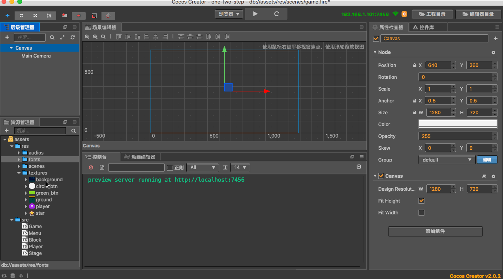

然后添加一个空节点Stage，在Stage下添加一个Player节点和一个Block节点

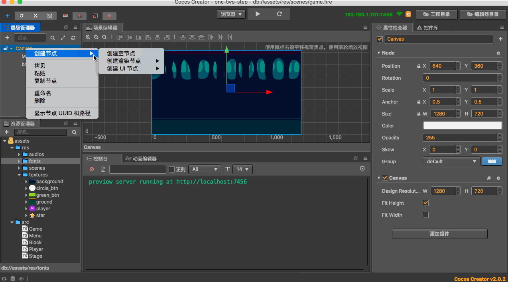

在Stage同层添加两个按钮来控制跳一步两步

先添加第一个按钮，根据实际效果调整文字大小（font size）颜色（node color）和按钮的缩放倍数（scale）

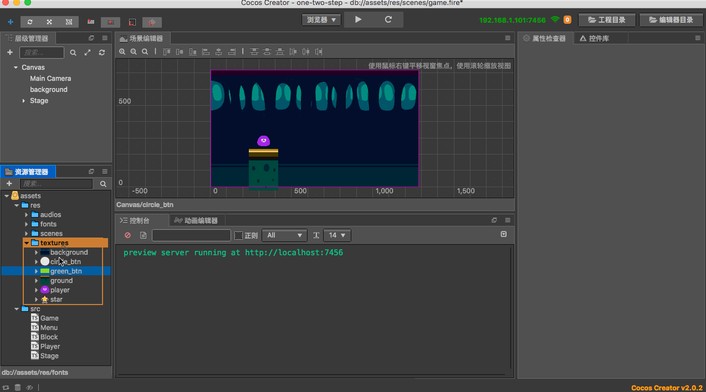

第二个按钮可以直接由第一个按钮复制

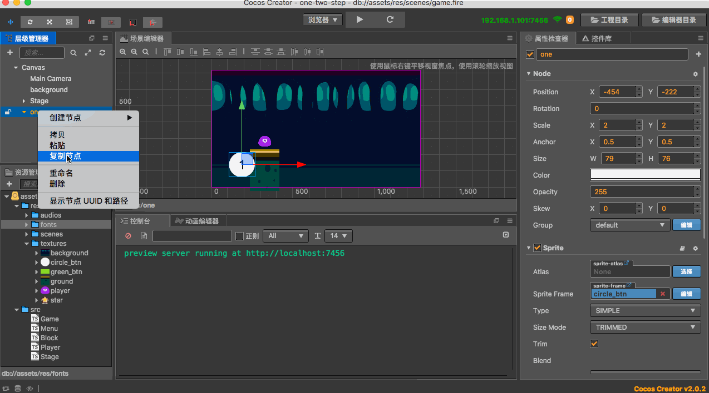

这两个按钮显然是要放置在屏幕左下角和右下角的，但是不同屏幕大小可能导致这两个按钮的位置跑偏，所以最好的方案是给这两个按钮节点添加Widget组件，让它们跟左下角和右下角保持固定的距离，这里就不演示了，相信你可以自己完成（其实是我忘录了。。。）

添加一个Label节点记录分数，系统字体有点丑，这里替换成我们自己的字体

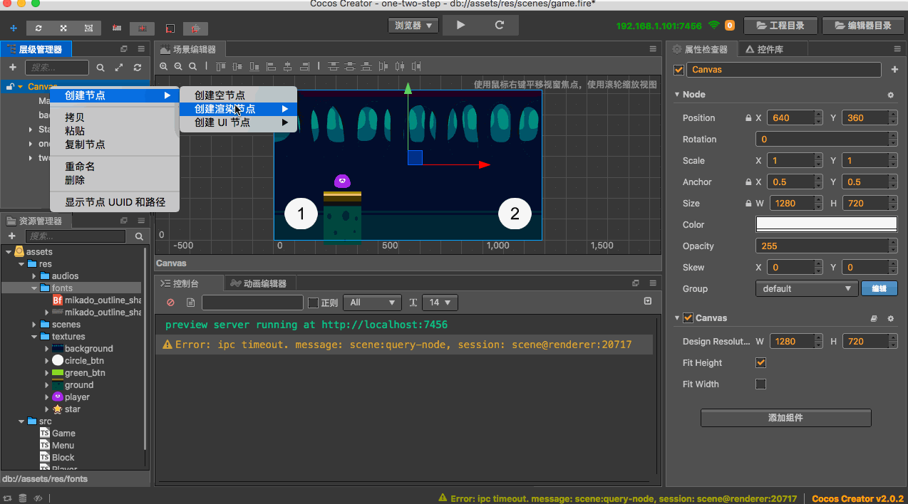

最后把脚本挂在对应的节点上。

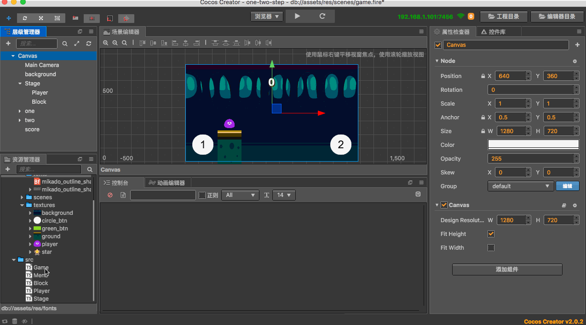

场景搭建到这里基本完成了，现在可以编写脚本了。

Game作为一个统领全局的脚本，一定要控制关键的逻辑，，比如开始游戏和结束游戏，增加分数，还有一些全局的事件。

**Game.ts**

```js
import { Stage } from './Stage';

const { ccclass, property } = cc._decorator;

@ccclass
export class Game extends cc.Component {

    @property(Stage)
    private stage: Stage = null;
    @property(cc.Label)
    private scoreLabel: cc.Label = null;

    private score: number = 0;

    protected start() {
        this.startGame();
    }

    public addScore(n: number) {
        this.score += n;
        this.scoreLabel.string = this.score + '';
    }

    public startGame() {
        this.score = 0;
        this.scoreLabel.string = '0';
        this.stage.init(this);
    }

    public overGame() {
        cc.log('game over');
    }

    public restartGame() {
        cc.director.loadScene('game');
    }

    public returnMenu() {
        cc.director.loadScene('menu');
    }

    private onBtnOne() {
        this.stage.playerJump(1);
    }

    private onBtnTwo() {
        this.stage.playerJump(2);
    }
}

```
Stage作为Game直接控制的脚本，要给Game暴露出操作的接口并且保存Game的引用，当游戏状态发生改变时，通知Game处理。

**Stage.ts**
```js
import { Game } from './Game';
import { Player } from './Player';

const { ccclass, property } = cc._decorator;

@ccclass
export class Stage extends cc.Component {

    @property(Player)
    private player: Player = null;

    private game: Game = null;

    public init(game: Game) {
        this.game = game;
    }

    public playerJump(step: number) {
        this.player.jump(step);
    }

}
```
而Player作为最底层的一个小员工，别人让你做啥你就做啥。

**Player.ts**
```js
const {ccclass, property} = cc._decorator;

@ccclass
export class Player extends cc.Component {

    public jump(step: number) {
        if (step === 1) {
            cc.log('我跳了1步');
        } else if (step === 2) {
            cc.log('我跳了2步');
        }
    }

    public die() {
        cc.log('我死了');
    }

}

```
之前讲了`@ccclass`是为了让编辑器识别这是一个组件类，可以挂在节点上，现在我们又看到了一个`@property`,这个是为了让一个组件的属性暴露在编辑器属性中，观察最上面的`Game`脚本，发现有三个成员变量，`stage`,`scoreLabel`和`score`，而只有前两个变量加上了`@property`,所以编辑器中只能看到`stage`和`scoreLabel`。

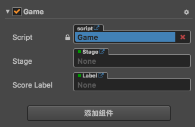

`@property`括号里通常要填一个编辑器可以识别的类型，比如系统自带的`cc.Label`,`cc.Node`,`cc.Sprite`,`cc.Integer`,`cc.Float`等，也可以是用户脚本类名,比如上面的`Stage`和`Player`。

回到编辑器，我们把几个脚本暴露在编辑器的变量通过拖拽的方式指向带有类型组件的节点。

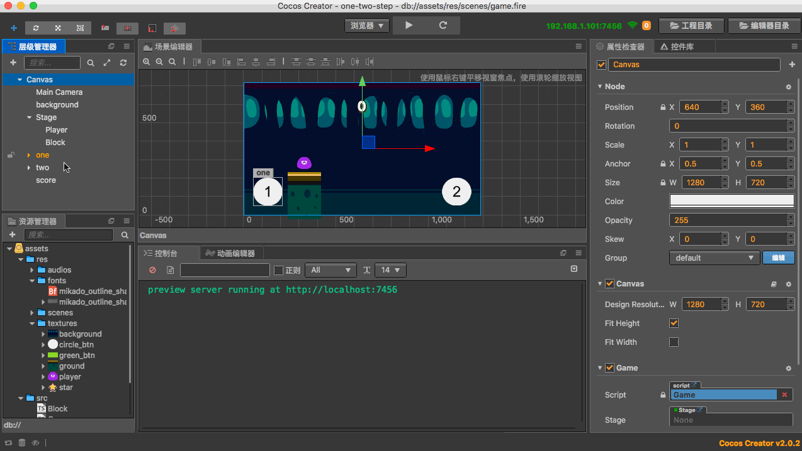

再把one，two两个按钮分别绑定在game里的onBtnOne，onBtnTwo两个函数上。


这时我们已经有了一个简单的逻辑，点击1或2按钮，调用Game里的onBtnOne或onBtnTwo，传递给Stage调用playerJump，再传递给Player调用jump，player就会表现出跳一步还是跳两步的反应。

点击预览按钮，进行测试：


> 你可以按F12(windows)或cmd+opt+i(mac)打开chrome的开发者工具。

## 人物跳跃动作

现在我们来让Player跳起来，人物动作的实现大概可以借助以下几种方式实现：

- 动画系统
- 动作系统
- 物理系统
- 实时计算

可以看到这个游戏人物动作比较简单，跳跃路径是固定的，所以我们选择用动作系统实现人物的跳跃动作。

creator自带一套基于节点的动作系统，形式如`node.runAction(action)`。

修改Player.ts,添加几个描述跳跃动作的参数，并且添加一个init函数由上层组件即Stage初始化时调用并传入所需参数。另外更改jump函数内容让Player执行jumpBy动作。

**Player.ts**
```js
...

private stepDistance: number; // 一步跳跃距离
private jumpHeight: number; // 跳跃高度
private jumpDuration: number; // 跳跃持续时间
public canJump: boolean; // 此时是否能跳跃

public init(stepDistance: number, jumpHeight: number, jumpDuration: number) {
    this.stepDistance = stepDistance;
    this.jumpHeight = jumpHeight;
    this.jumpDuration = jumpDuration;
    this.canJump = true;
}

public jump(step: number) {
    this.canJump = false;
    this.index += step;
    let jumpAction = cc.jumpBy(this.jumpDuration, cc.v2(step * this.stepDistance, 0), this.jumpHeight, 1);
    let finishAction = cc.callFunc(() => {
        this.canJump = true;
    });
    this.node.runAction(cc.sequence(jumpAction, finishAction));
}

...
```

**Stage.ts**

```js
...

@property(cc.Integer)
private stepDistance: number = 200;
@property(cc.Integer)
private jumpHeight: number = 100;
@property(cc.Float)
private jumpDuration: number = 0.3;

@property(Player)
private player: Player = null;

private game: Game = null;

public init(game: Game) {
    this.game = game;
    this.player.init(this.stepDistance, this.jumpHeight, this.jumpDuration);
}

public playerJump(step: number) {
    if (this.player.canJump) {
        this.player.jump(step);
    }
}

...
```

这里要介绍一下 Cocos Creator 的动作系统，动作系统基于节点，你可以让一个节点执行一个瞬时动作或持续性的动作。比如让一个节点执行一个“3秒钟向右移动100”的动作，就可以这样写

```js
let moveAction = cc.moveBy(3, cc.v2(100, 0)); // cc.v2可以创建一个二位的点（向量），代表方向x=100,y=0
this.node.runAction(moveAction);
```
更多的动作使用可查询文档 http://docs.cocos.com/creator/manual/zh/scripting/action-list.html

回头看Player的jump方法，这里我们的意图是让Player执行一个跳跃动作，当跳跃动作完成时将this.canJump改为true，cc.CallFunc也是一个动作，这个动作可以执行你传入的一个函数。所以上面的finishAction执行的时候就可以将this.canJump改为true,cc.sequence用于将几个动作连接依次执行。

> 可以看到jumpAction传入了很多参数，有些参数可以直接根据名字猜到，有一些可能不知道代表什么意思，这时你就要善于搜索api，另外要充分利用ts提示的功能,你可以直接按住ctrl/cmd+鼠标单击进入定义文件查看说明示例。


再来看Stage，可以看到Player初始化的几个参数是由Stage传递的，并且暴露在了编辑器界面，我们可以直接在Stage的属性面板调整参数，来直观的编辑动作效果，这也是Creator编辑器的方便之处。

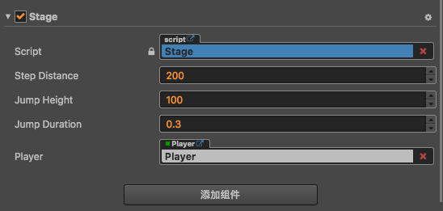

上面的几个参数是我调整过后的，你也可以适当的修改，保存场景后预览效果。


## 动态添加地面和移动场景

显而易见，我们不可能提前设置好所有的地面（Block），而是要根据Player跳跃的时机和地点动态添加Block，这就涉及到一个新的知识点——如何用代码创建节点？

每一个Block节点都是一样的，对于这样相同的节点可以抽象出一个模板，Creator里管这个模板叫做预制体（Prefab），想要一个新的节点时就可以通过复制Prefab得到。

制作一个Prefab很简单，我们先在res目录下新建一个prefabs目录，然后将Block节点直接拖到目录里就可以形成一个Prefab了。

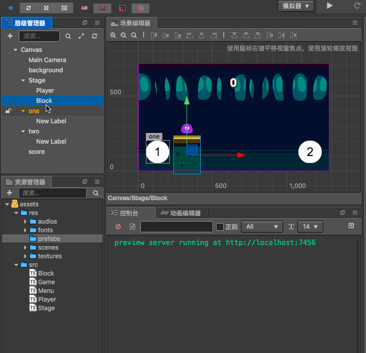

你可以双击这个prefab进入其编辑模式，如果之前忘了将Block脚本挂在Block节点上，这里也可以挂在Block的Prefab上。

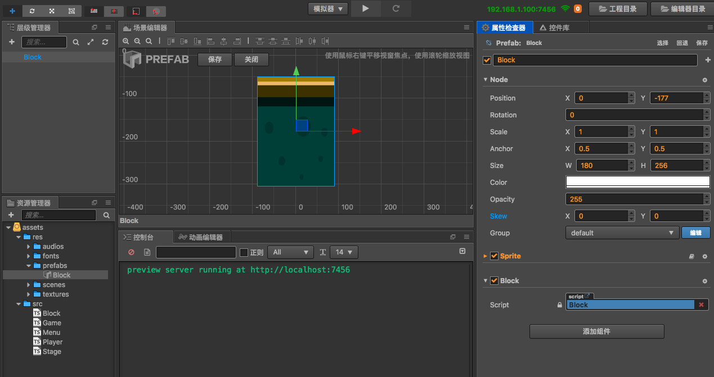

有了Prefab后，我们就可以利用函数`cc.instance`来创建出一个节点。

根据之前讲的组织代码原则，创建Block的职责应该交给他的上级，也就是Stage。

之前编写Player代码时设置了一个index变量，用来记录Player跳到了“第几格”，根据游戏逻辑每当Player跳跃动作完成后就要有新的Block出现在前面。修改Stage如下：

**Stage.ts**

```js
import { Game } from './Game';
import { Player } from './Player';
import { Block } from './Block';

const { ccclass, property } = cc._decorator;

@ccclass
export class Stage extends cc.Component {

    @property(cc.Integer)
    private stepDistance: number = 200;
    @property(cc.Integer)
    private jumpHeight: number = 100;
    @property(cc.Float)
    private jumpDuration: number = 0.3;
    @property(Player)
    private player: Player = null;

    @property(cc.Prefab)
    private blockPrefab: cc.Prefab = null; // 编辑器属性引用

    private lastBlock = true; // 记录上一次是否添加了Block
    private lastBlockX = 0; // 记录上一次添加Block的x坐标
    private blockList: Array<Block>; // 记录添加的Block列表

    private game: Game = null;

    public init(game: Game) {
        this.game = game;
        this.player.init(this.stepDistance, this.jumpHeight, this.jumpDuration);
        this.blockList = [];
        this.addBlock(cc.v2(0, 0));
        for (let i = 0; i < 5; i++) {
            this.randomAddBlock();
        }
    }

    public playerJump(step: number) {
        if (this.player.canJump) {
            this.player.jump(step);
            this.moveStage(step);
            let isDead = !this.hasBlock(this.player.index);
            if (isDead) {
                cc.log('die');
                this.game.overGame();
            } else {
                this.game.addScore(step === 1 ? 1 : 3); // 跳一步得一分，跳两步的三分
            }
        }
    }

    private moveStage(step: number) {
        let moveAction = cc.moveBy(this.jumpDuration, cc.v2(-this.stepDistance * step, 0));
        this.node.runAction(moveAction);
        for (let i = 0; i < step; i++) {
            this.randomAddBlock();
        }
    }

    private randomAddBlock() {
        if (!this.lastBlock || Math.random() > 0.5) {
            this.addBlock(cc.v2(this.lastBlockX + this.stepDistance, 0));
        } else {
            this.addBlank();
        }
        this.lastBlockX = this.lastBlockX + this.stepDistance;
    }

    private addBlock(position: cc.Vec2) {
        let blockNode = cc.instantiate(this.blockPrefab);
        this.node.addChild(blockNode);
        blockNode.position = position;
        this.blockList.push(blockNode.getComponent(Block));
        this.lastBlock = true;
    }

    private addBlank() {
        this.blockList.push(null);
        this.lastBlock = false;
    }

    private hasBlock(index: number): boolean {
        return this.blockList[index] !== null;
    }

}
```

首先我们在最上面添加了几个成员变量又来记录Block的相关信息。
然后修改了playerJump方法，让player跳跃的同时执行moveStage，moveStage方法里调用了一个moveBy动作，这个动作就是把节点相对移动一段距离，这里要注意的是moveStage动作和player里的jump动作水平移动的距离绝对值和时间都是相等的，player向前跳，stage向后移动，这样两个相反的动作，就会让player始终处于屏幕中的固定位置而不会跳到屏幕外了。

再看moveStage方法里会调用randomAddBlock，也就是随机添加block，随机算法要根据游戏规则推理一下：

这个游戏的操作分支只有两个：1步或者是2步。所以每2个Block的间隔只能是0步或者1步。因此randomAddBlock里会判断最后一个Block是否为空，如果为空那新添加的一定不能为空。如果不为空则50%的概率随机添加或不添加Block。这样就能得到无限随机的地图了。

为了激励玩家多按2步，所以设定跳1步的1分，跳2步得3分。

另外Player跳几步randomAddBlock就要调用几次，这样才能保证地图与Player跳跃距离相匹配。

再说一下addBlock方法，blockNode是由blockPrefab复制出来的，你必须通过addChild方法把它添加场景中的某个节点下才能让它显示出来，这里的this.node就是Stage节点。为了方便我们把lastBlockX初始值设为0，也就是水平第一个block的横坐标应该等于0，所以我们要回到编辑器调整一下stage,player,block三个节点的位置，让block和player的x都等于0，并且把Block的宽度设为180（一步的距离设为200，为了让两个相邻的Block有一点间距，要适当窄一些），最后不要忘记把BlockPrefab拖入对应的属性上。


playerJump的的最后有一段判断游戏结束的逻辑，之前我们在player里设置了一个变量index，记录player当前跳到第几格，stage里也有一个数组变量blockList保存着所有格子的信息，当player跳完后判断一下落地点是否有格子就可以判断游戏是否结束。

捋顺上面的逻辑后，你就可以预览一下这个看起来有点样子的游戏了

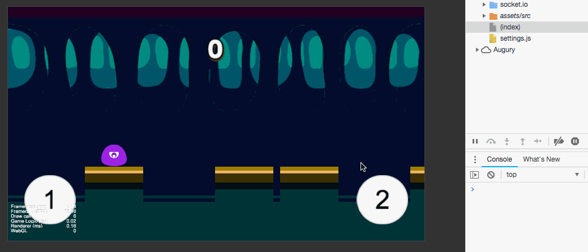

## 地面下沉效果

如果每一步都让玩家想很久，那这个游戏就没有尽头了。现在我们给它加点难度。

设置的效果是：地面每隔一段时间就会下落，如果玩家没有及时跳到下一个格子就会跟着地面掉下去，为了实现这个人物和地面同时下坠的效果，我们要让Player和Block执行相同的动作，所以在Stage上新加两个变量fallDuration和fallHeight用来代表下落动作的时间和高度，然后传给Player和Block让它们执行。

另外这种小游戏的难度一定是要随着时间增加而增大的，所以Block的下落时间要越来越快。

下面我们来修改Block，Player，Stage三个脚本

**Block.ts**

```js
const { ccclass } = cc._decorator;

@ccclass
export class Block extends cc.Component {

    public init(fallDuration: number, fallHeight: number, destroyTime: number, destroyCb: Function) {
        this.scheduleOnce(() => {
            let fallAction = cc.moveBy(fallDuration, cc.v2(0, -fallHeight)); // 下沉动作
            this.node.runAction(fallAction);
            destroyCb();
        }, destroyTime);
    }

}
```
这里补充了Block的init方法，传入了四个参数，分别是坠落动作的持续时间，坠落动作的高度，销毁时间，销毁的回调函数。

scheduleOnce是一个一次性定时函数，存在于cc.Component里，所以你可以在脚本里直接通过this来调用这个函数,这里要实现的效果就是延迟destroyTime时间执行下落动作。

**Player.ts**

```js
const { ccclass } = cc._decorator;

@ccclass
export class Player extends cc.Component {

    private stepDistance: number; // 一步跳跃距离
    private jumpHeight: number; // 跳跃高度
    private jumpDuration: number; // 跳跃持续时间
    private fallDuration: number; // 坠落持续时间
    private fallHeight: number; // 坠落高度
    public canJump: boolean; // 此时是否能跳跃
    public index: number; // 当前跳到第几格

    public init(stepDistance: number, jumpHeight: number, jumpDuration: number, fallDuration: number, fallHeight: number) {
        this.stepDistance = stepDistance;
        this.jumpHeight = jumpHeight;
        this.jumpDuration = jumpDuration;
        this.fallDuration = fallDuration;
        this.fallHeight = fallHeight;
        this.canJump = true;
        this.index = 0;
    }

...

    public die() {
        this.canJump = false;
        let dieAction = cc.moveBy(this.fallDuration, cc.v2(0, -this.fallHeight));
        this.node.runAction(dieAction);
    }

}
```

首先将init里多传入两个变量fallDuration和fallHeight用来实现下落动作，然后补充die方法，这里的下落动作其实是个上面的Block里的下落动作是一样的。

**Stage.ts**

```js
...

@property(cc.Integer)
private fallHeight: number = 500;
@property(cc.Float)
private fallDuration: number = 0.3;
@property(cc.Float)
private initStayDuration: number = 2; // 初始停留时间
@property(cc.Float)
private minStayDuration: number = 0.3; // 最小停留时间，不能再快了的那个点，不然玩家就反应不过来了
@property(cc.Float)
private speed: number = 0.1;

private stayDuration: number; // 停留时间

...

public init(game: Game) {
    this.game = game;
    this.stayDuration = this.initStayDuration;
    this.player.init(this.stepDistance, this.jumpHeight, this.jumpDuration, this.fallDuration, this.fallHeight);
    this.blockList = [];
    this.addBlock(cc.v2(0, 0));
    for (let i = 0; i < 5; i++) {
        this.randomAddBlock();
    }
}

public addSpeed() {
    this.stayDuration -= this.speed;
    if (this.stayDuration <= this.minStayDuration) {
        this.stayDuration = this.minStayDuration;
    }
    cc.log(this.stayDuration);
}

public playerJump(step: number) {
    if (this.player.canJump) {
        this.player.jump(step);
        this.moveStage(step);
        let isDead = !this.hasBlock(this.player.index);
        if (isDead) {
            cc.log('die');
            this.scheduleOnce(() => { // 这时还在空中，要等到落到地面在执行死亡动画
                this.player.die();
                this.game.overGame();
            }, this.jumpDuration);
        } else {
            let blockIndex = this.player.index;
            this.blockList[blockIndex].init(this.fallDuration, this.fallHeight, this.stayDuration, () => { 
                if (this.player.index === blockIndex) { // 如果Block下落时玩家还在上面游戏结束
                    this.player.die();
                    this.game.overGame();
                }
            });
            this.game.addScore(step === 1 ? 1 : 3);
        }
        if (this.player.index % 10 === 0) {
            this.addSpeed();
        }
    }
}

...
```

Player和Block下落动作都需要的fallDuration和fallHeight我们提取到Stage里，然后又添加了几个属性来计算Block存留时间。

在playerJump方法里，补充了Player跳跃后的逻辑：如果Player跳空了，那么就执行死亡动画也就是下落动作，如果Player跳到Block上，那么这个Block就启动下落计时器，当Block下落时Player还没有跳走，那就和Player一起掉下去。

最后增加下落速度的方式是每隔十个格子加速一次。

回到编辑器，调整fallDuration，fallHeight，initStayDuration，minStayDuration，speed的值。

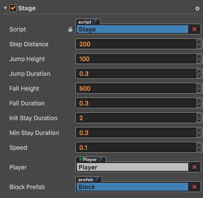

预览游戏

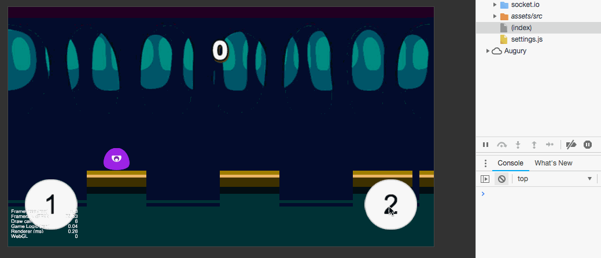


## 添加结算面板

前面讲了这么多，相信你能自己拼出下面这个界面。

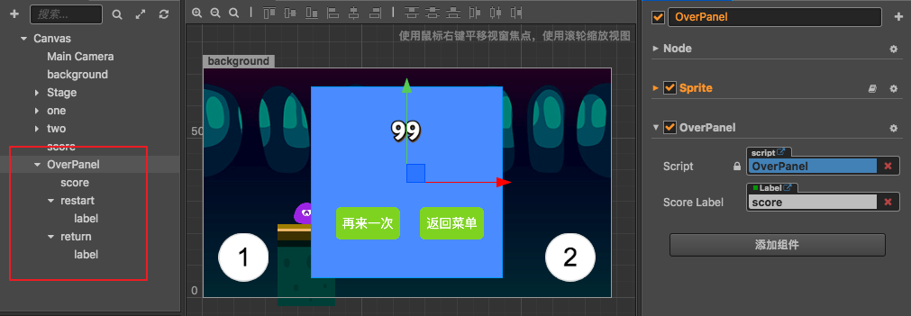

上面挂载的OverPanel脚本如下：

**OverPanel.ts**

```js
import { Game } from "./Game";

const { ccclass, property } = cc._decorator;

@ccclass
export class OverPanel extends cc.Component {

    @property(cc.Label)
    private scoreLabel: cc.Label = null;

    private game: Game;

    public init(game: Game) {
        this.game = game;
    }

    private onBtnRestart() {
        this.game.restartGame();
    }

    private onBtnReturnMenu() {
        this.game.returnMenu();
    }

    public show(score: number) {
        this.node.active = true;
        this.scoreLabel.string = score + '';
    }

    public hide() {
        this.node.active = false;
    }

}
```

不要忘了将两个按钮绑定到对应的方法上。

最后修改Game,让游戏结束时显示OverPanel

**Game.ts**

```js
import { Stage } from './Stage';
import { OverPanel } from './OverPanel';

const { ccclass, property } = cc._decorator;

@ccclass
export class Game extends cc.Component {

    @property(Stage)
    private stage: Stage = null;
    @property(cc.Label)
    private scoreLabel: cc.Label = null;
    @property(OverPanel)
    private overPanel: OverPanel = null;

    private score: number = 0;

    protected start() {
        this.overPanel.init(this);
        this.overPanel.hide();
        this.startGame();
    }

    public addScore(n: number) {
        this.score += n;
        this.scoreLabel.string = this.score + '';
    }

    public startGame() {
        this.score = 0;
        this.scoreLabel.string = '0';
        this.stage.init(this);
    }

    public overGame() {
        this.overPanel.show(this.score);
    }

    public restartGame() {
        cc.director.loadScene('game');
    }

    public returnMenu() {
        cc.director.loadScene('menu');
    }

    private onBtnOne() {
        this.stage.playerJump(1);
    }

    private onBtnTwo() {
        this.stage.playerJump(2);
    }
}
```
将OverPanel的属性拖上去。


为了不影响编辑器界面，你可以将OverPanel节点隐藏

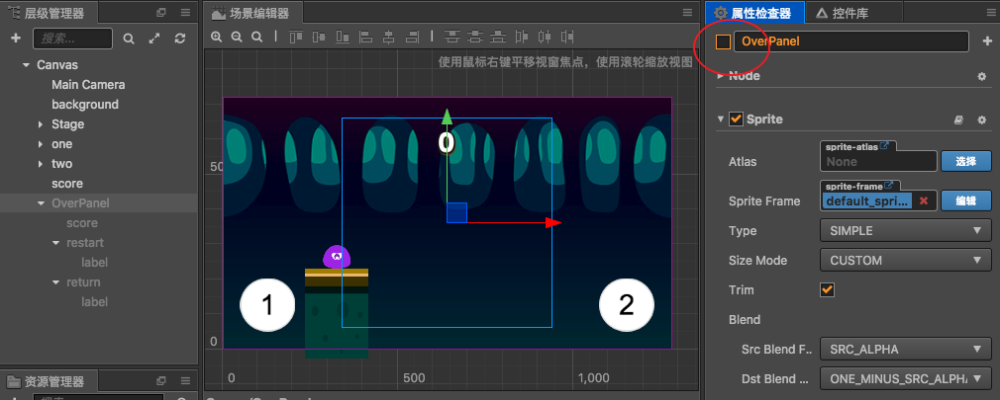

预览效果


## 添加声音和键盘操作方式

如果你玩过这个游戏，肯定知道声音才是其灵魂。

既然是Player发出的声音，就挂在Player身上吧

**Player.ts**

```js
const { ccclass, property } = cc._decorator;

@ccclass
export class Player extends cc.Component {

    @property({
        type: cc.AudioClip
    })
    private oneStepAudio: cc.AudioClip = null;
    @property({
        type:cc.AudioClip
    })
    private twoStepAudio: cc.AudioClip = null;
    @property({
        type:cc.AudioClip
    })
    private dieAudio: cc.AudioClip = null;

    ...

    public jump(step: number) {

        ...

        if (step === 1) {
            cc.audioEngine.play(this.oneStepAudio, false, 1);
        } else if (step === 2) {
            cc.audioEngine.play(this.twoStepAudio, false, 1);
        }
    }

    public die() {
        
        ...

        cc.audioEngine.play(this.dieAudio, false, 1);
    }

}
```



这里你可能比较奇怪的为什么这样写
```js
@property({
    type: cc.AudioClip
})
private oneStepAudio: cc.AudioClip = null;
```
而不是这样写
```js
@property(cc.AudioClip)
private oneStepAudio: cc.AudioClip = null;
```
其实上面的写法才是完整写法，除了type还有displayName等参数可选，当只需要type这个参数时可以写成下面那种简写形式，但例外的是有些类型只能写完整形式，不然就会抱警告，cc.AudioClip就是其一。

在电脑上点击两个按钮很难操作，所以我们添加键盘的操作方式。

**Game.ts**

```js
import { Stage } from './Stage';
import { OverPanel } from './OverPanel';

const { ccclass, property } = cc._decorator;

@ccclass
export class Game extends cc.Component {

    ...

    protected start() {
        
        ...

        this.addListeners();
    }

    ...

    private addListeners() {
        cc.systemEvent.on(cc.SystemEvent.EventType.KEY_DOWN, (event: cc.Event.EventKeyboard) => {
            if (event.keyCode === cc.macro.KEY.left) {
                this.onBtnOne();
            } else if (event.keyCode === cc.macro.KEY.right) {
                this.onBtnTwo();
            }
        }, this);
    }

}

```

在游戏初始化的时候通过cc.systemEvent注册键盘事件，按左方向键跳一步，按右方向键跳两步。

至此我们的游戏就做完了。

[一步两步](https://ccc.xinshouit.com/demo/one-two-step/ ':include :type=iframe width=320px height=180px')

如果你有基础，这个游戏并不难，如果这是你的第一篇教程，你可能会很吃力，无论前者后者，遇到任何问题都可以在下方留言，我也会随时更新。

另外不要忘了加QQ交流群哦 **863758586**

