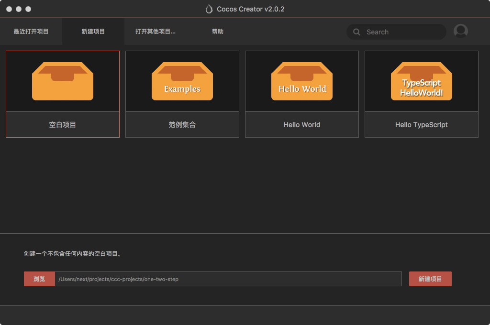
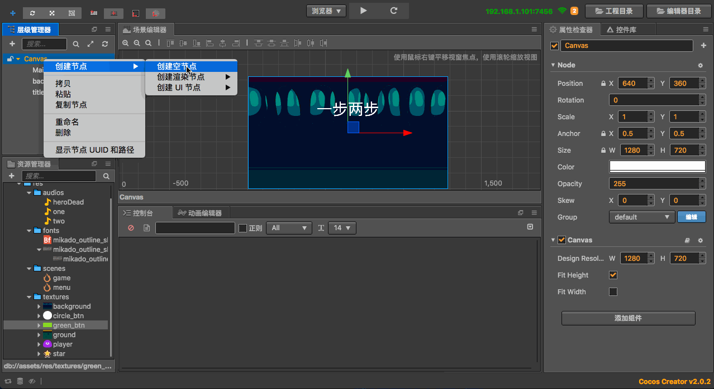
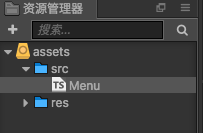
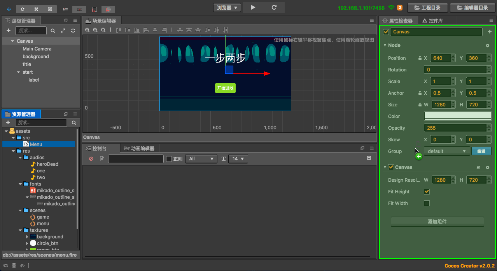
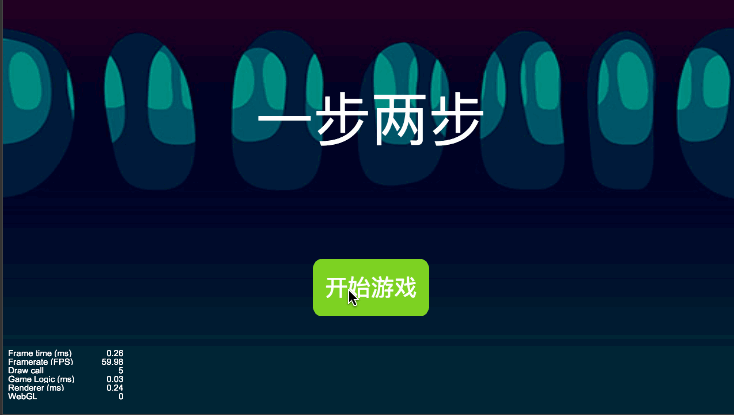

# 第一个游戏

这节我们从头做一个比较有意思的小游戏——一步两步。

下面是最终效果(跳一步得一分，跳两步得三分）：

[一步两步](https://ccc.xinshouit.com/demo/one-two-step/ ':include :type=iframe width=640px height=360px')

## 写在前面

这是本教程第一个游戏，所以我会讲的详细一点，但是也不能避免遗漏，所以有什么问题你可以先尝试查阅文档自己解决或者在下方留言，后面我会跟进完善。

另外这个游戏并非原创，参照的是腾讯的微信小游戏《一步两步H5》，请不要直接搬过去，微信里重复的游戏太多了。

## 创建工程

选择空白项目创建工程



你可以从[这里](https://github.com/potato47/one-two-step/releases/download/v2.0/one-two-step-res.zip)下载游戏素材,然后将素材导入工程（直接拖进编辑器，或者放在工程目录）


 > 准备工作做完后，我会把这个游戏制作过程分为若干个小过程，让你体会一下实际的游戏制作体验。

## 从一个场景跳转到另一个场景

在res文件夹下新建一个scenes文件夹，然后在scenes里新建两个场景menu和game（右键->新建->Scene)。然后双击menu进入menu场景。


在层级管理器中选中Canvas节点，在右侧属性检查器中将其设计分辨率调整为1280x720，然后将background图片拖入Canvas节点下，并为其添加Widget组件（添加组件->UI组件->Widget),使其充满画布。


在Canvas下新建一个Label节点（右键->创建节点->创建渲染节点->Label），然后调整文字大小，并添加标题文字


我们知道节点和组件通常是一起出现的，带有常见组件的节点在编辑器里可以直接创建，比如刚才的带有Label组件的节点和带有Sprite组件的节点，但是我们也可以新建一个空节点然后为其添加对应的组件来组装一个带有特殊功能的节点。

新建节点->UI节点下有一个Button，如果你直接创建Button，你会发现它是一个带有Button组件的节点，并且有一个Label的子节点。现在我们用另一种方法创建Button：在Canvas右键新建一个空节点，然后为其添加Button组件，这时你会发现按钮并没有背景，所以我们再添加一个Sprite组件，拖入资源中的按钮背景图片，最后添加一个Label子节点给按钮添加上文字。



下面我们给这个按钮添加点击事件。

在资源管理器中新建src文件夹用来存放脚本，然后新建一个TypeScript脚本，名字为Menu。



双击用VS Code打开脚本，更改如下：

``` javascript
const { ccclass } = cc._decorator;

@ccclass // 让编辑器能够识别这是一个组件
export class Menu extends cc.Component {

    private onBtnStart() {
        cc.director.loadScene('game'); //加载game场景
    }

}
```

> 一个类只有加上@ccclass才能被编辑器识别为脚本组件，如果你去掉@ccclass，你就不能把这个组件拖到节点上。

很明显，我们想在点击开始按钮的时候调用onBtnStart函数，然后跳转到game场景。为了测试效果我们先打开game场景，然后放一个测试文字（将Canvas的设计分辨率也改为1280x720）。


保存game场景后再回到Menu场景。

Button组件点击后会发出一个事件，这个事件可以跟某个节点上的某个脚本内的某个函数绑定在一起。听着有点绕，动手做一遍就会明白这个机制。

首先将Menu脚本添加为Canvas节点的组件，然后在开始按钮的Button组件里添加一个Click Event，将其指向Canvas节点下的Menu脚本里的onBtnStart函数。



我们再调整一下Button的点击效果,将Button组件的Transition改为scale（伸缩效果），另外还有颜色变化和图片变化，可以自己尝试。


最后点击上方的预览按钮，不出意外的话就可以在浏览器中看见预期效果。



## 组织代码结构

现在我们来编写游戏逻辑。

首先我来讲一下我看到的一种现象：

很多新手非常喜欢问，“看代码我都能看懂啊，但是要我自己写我就没思路啊”

这时一位经验颇多的长者就会甩给他一句，“多写写就有思路了“

不知道你们发现没有，这竟然是一个死循环。

对于一个刚开始学习做游戏的人，首先要了解的是如何组织你的代码，这里我教给大家一个最容易入门的代码结构——单向分权结构（这是我想了足足两分钟的自认为很酷炫的一个名字）

脚本分层：

这个结构最重要的就是“权”这个字，我们把一个场景中使用的脚本按照“权力”大小给它们分层，权力最大的在最上层且只有一个，这个脚本里保存着它直接控制的若干个脚本的引用，被引用的脚本权力就小一级，被引用的脚本还会引用比它权力更小的脚本，依此类推。

脚本互操作：

1. 上一层的脚本由于保存着下一层脚本的引用，所以可以直接操作下一层的脚本。
2. 下一层的脚本由上一层的脚本初始化，在初始化的时候会传入上一层的引用（可选），这样在需要的时候会反馈给上一层，由上一层执行更具体的操作。
3. 同层的脚本尽量不要互相操作，统一交给上层处理，同层解耦。
4. 不可避免的同层或跨层脚本操作可以使用全局事件来完成。
5. 具有通用功能的脚本抽离出来，任意层的脚本都可以直接使用。

写了这么多，但你肯定没看懂，现在你可以翻到最上面再分析一下游戏的game场景，如何组织这个场景的脚本结构？

首先，一个场景的根节点会挂载一个脚本，通常以场景名命名，这里就是Game。

然后跳跃的人物也对应着一个脚本Player。

跟Player同层的还应该有Block也就是人物踩着的地面方块。

因为Player和Block之间互相影响并且我想让Game脚本更简洁，所以这里再加一个Stage（舞台）脚本来控制Player和Block。

最终它们的层级关系如下：

- Game 
  - Stage
    - Player
    - Block
         


